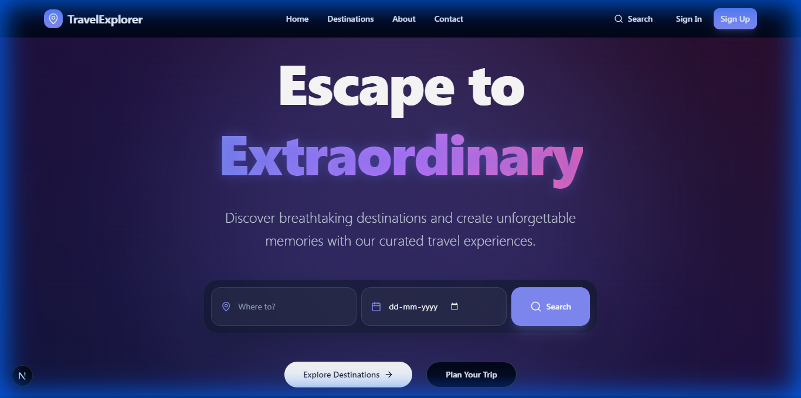
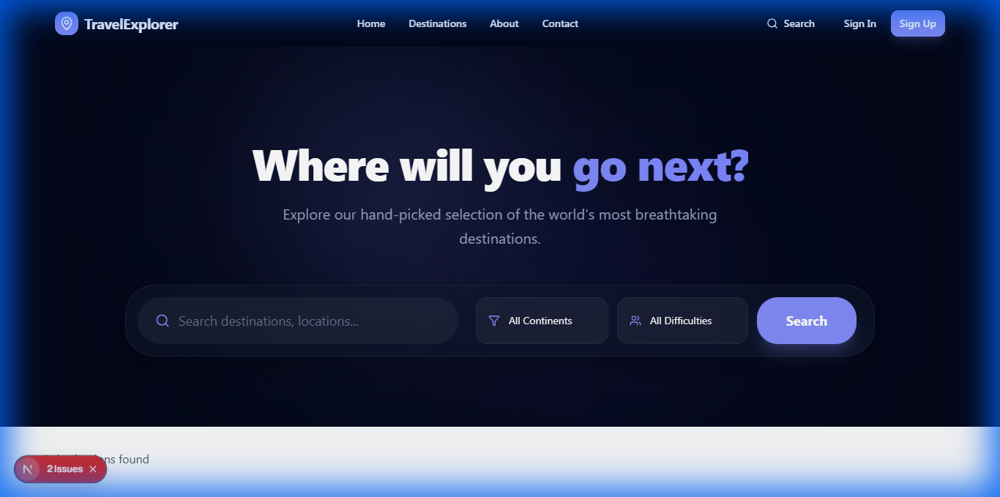
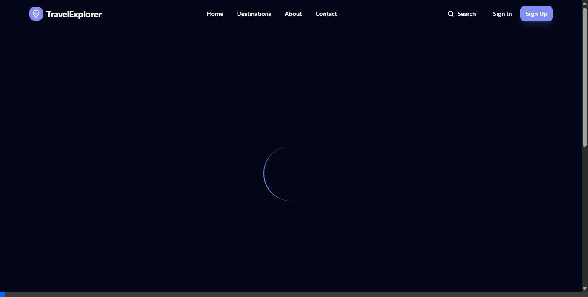
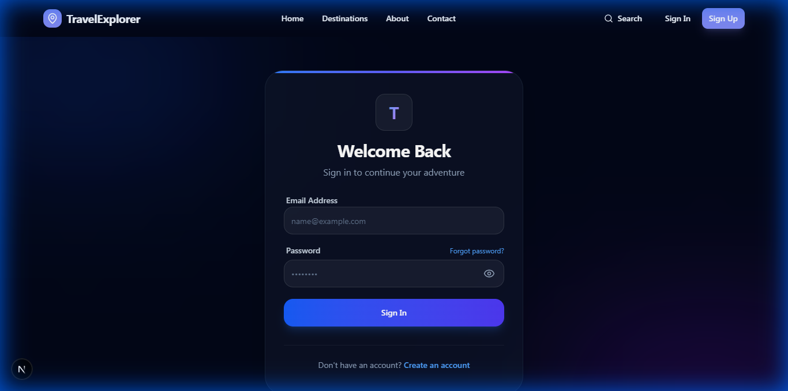

# TravelExplorer 🌍

TravelExplorer is a premium, full-stack travel discovery and booking application designed with a focus on high-end aesthetics and seamless user experience.



Built with **Next.js 14**, **Tailwind CSS**, and **Supabase**, it features a modern, immersive design with glassmorphism, dynamic animations powered by Framer Motion, and a robust fallback system to ensure the application remains visually stunning even when offline.

## ✨ Features



- **Premium UI/UX**: Immersive dark theme with glassmorphism, animated gradients, and floating elements.
- **Dynamic Destinations**: Explore curated destinations with rich imagery, detailed itineraries, and travel facts.
- **Advanced Search & Filters**: Effortlessly find your next adventure by location, continent, or difficulty.
- **Intelligent Fallback System**: Seamless experience with high-quality sample data when the database is unavailable.
- **Secure Booking Flow**: Streamlined booking process with real-time feedback and confirmation.
- **Modern Tech Stack**: Next.js (App Router), Lucide Icons, Framer Motion, and Shadcn UI components.

## 🖼️ Visual Demonstrations

### Destinations & Discovery


### Booking & Details



### Authentication & Pages



## 🚀 Getting Started

### Prerequisites

- [Node.js](https://nodejs.org/) (v18.0 or higher)
- [npm](https://www.npmjs.com/) or [yarn](https://yarnpkg.com/)
- [Supabase](https://supabase.com/) account (optional for local sample data)

### Installation

1. **Clone the repository**:
   ```bash
   git clone https://github.com/your-username/travelexplorer.git
   cd travelexplorer
   ```

2. **Install dependencies**:
   ```bash
   npm install
   ```

3. **Set up Environment Variables**:
   Copy the example environment file and fill in your credentials:
   ```bash
   cp .env.local.example .env.local
   ```
   *Note: The application will use premium fallback data if Supabase keys are not provided.*

4. **Run the development server**:
   ```bash
   npm run dev
   ```

5. **Open the application**:
   Navigate to [http://localhost:3000](http://localhost:3000) in your browser.

## 🛠️ Built With

- **Framework**: [Next.js 14](https://nextjs.org/)
- **Styling**: [Tailwind CSS](https://tailwindcss.com/)
- **Animations**: [Framer Motion](https://www.framer.com/motion/)
- **Database/Auth**: [Supabase](https://supabase.com/)
- **Icons**: [Lucide React](https://lucide.dev/)
- **Form Handling**: [React Hook Form](https://react-hook-form.com/) & [Zod](https://zod.dev/)

## 📦 Deployment

### Deploy to Vercel

The easiest way to deploy TravelExplorer is with [Vercel](https://vercel.com/new).

1. Push your code to a GitHub/GitLab/Bitbucket repository.
2. Import your project into Vercel.
3. Add your environment variables in the Vercel dashboard (see `.env.local.example` for the required keys).
4. Click **Deploy**.

## 📄 License

This project is licensed under the MIT License - see the [LICENSE](LICENSE) file for details.
